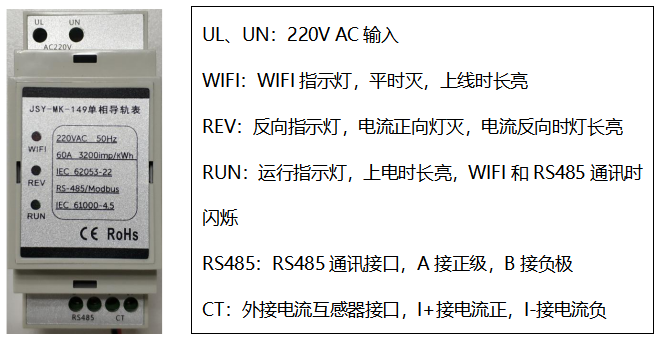

 JSY-MK-149 单相导轨式RS485电能测量仪是深圳市健思研科技有限公司推出的一款本地电能采集模块。

 <h3 style="height: 42px; color: rgb(33, 133, 197); font-weight: 100; margin-bottom: 25px; border-bottom-color: rgb(102, 102, 102); border-bottom-width: 2px; border-bottom-style: solid; float: left;">
		产品概述：/ Product overview 
	</h3>

	 

	&nbsp; JSY-MK-149 单相导轨式RS485电能测量仪是高度集成测量、数字通讯等，能够完成电能测量、采集及传输，单相交流电参数测量应用产品，准确测量单相交流电压、电流、功率、正反向电量及总电量等电参数，并具备1路RS-485通讯接口，MODBUS-RTU规约，具有极优的性价比。 

	&nbsp; JSY-MK-149 单相导轨式RS485电能测量仪可广泛应用于节能改造、电力、通信、铁路、交通、环保、石化、钢铁等行业中，用于远程监测交流设备的电流和电量消耗情况。 

	<h3 style="height: 42px; color: rgb(33, 133, 197); font-weight: 100; margin-bottom: 25px; border-bottom-color: rgb(102, 102, 102); border-bottom-width: 2px; border-bottom-style: solid; float: left;">
		产品技术参数：/ Product technical parameters 
	</h3>

	<b> </b> 

	 

	<b>1.&nbsp;单相交流输入</b> 

	1）电压量程：100V、220V等可选 

	2）电流量程：5A、50A、100A、150A等可选，外接开口互感器型号可选 

	3）信号处理：采用专用测量芯片，24位AD采用 

	4）过载能力：1.2倍量程可持续；瞬间（＜20mS）电流5倍，电压1.2倍量程不损坏 

	5）输入阻抗：电压通道＞1KΩ/V；电流通道&le;100mΩ 

	<b>2.&nbsp;通讯接口</b> 

	1）接口类型：RS-485接口 

	2）通讯规约：MODBUS-RTU规约 

	3）数据格式：&ldquo;n,8,1&rdquo; 

	4）通讯速率：RS-485通讯接口波特率可设置1200、2400、4800、9600Bps；波特率默认为9600Bps 

	<b>3.&nbsp;测量输出数据</b> 

	电压、电流、功率、电能、功率因素、频率等多个电参量， 

	<b>4.&nbsp;测量精度</b> 

	电压、电流、电量：&plusmn;1.0%，有功电度1级 

	<b>5.&nbsp;隔离</b> 

	RS-485接口与供电电源、电压输入、电流输出之间相互隔离；隔离耐压2000VAC 

	<b>6.&nbsp;电源</b> 

	1）可选100V、220V、电压线路100V~220V 

	2）AC220V供电时，峰值电压不得超过265V；典型功耗：&le;2W 

	<b>7.&nbsp;工作环境</b> 

	1）工作温度：-20～+70℃；存放温度：-40～+75℃。 

	2）相对湿度：5～95%，无结露（在40℃下）。 

	3）海拔高度：0~3000米 

	4）环境：无爆破、腐蚀气体及导电尘埃，无显著摇动、振动和冲击的场所。 

	<b>8.&nbsp;温度漂移</b>

	&le;100ppm/℃ 

	<b>9.&nbsp;安装方式</b> 

	2P导轨式安装 

	<b>10.&nbsp;产品外形及接口定义</b> 

